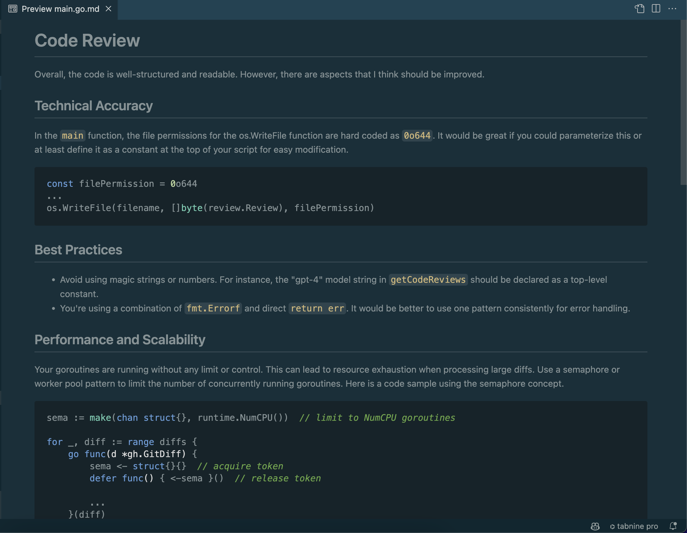
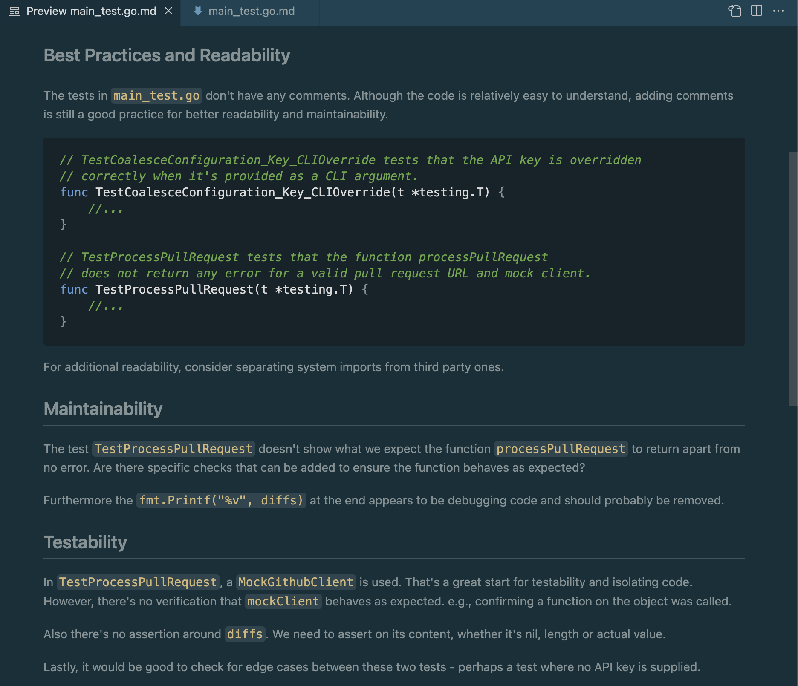
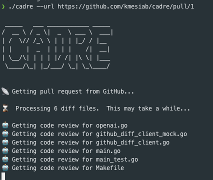

# Cadre CLI 🚀🤖


[](LICENSE)


[](https://goreportcard.com/report/github.com/kmesiab/cadre)

## Overview 🌟

Cadre CLI is a command-line application designed to automate code
reviews across various programming languages, utilizing OpenAI's
ChatGPT API. It offers intelligent insights and suggestions to
improve code quality and developer efficiency.

## Features 🛠️

- **Language-Agnostic Analysis**: Compatible with multiple programming
languages.
- **AI-Powered Insights**: Employs ChatGPT for in-depth code analysis.
- **User-Friendly CLI**: Simple and intuitive command-line interface
for easy usage.
- **Markdown Reports**: Outputs code reviews in markdown for flexible viewing
  and integration.
- **Configurable Model**: Use the default OpenAI model, or choose another



## Review Details

Each diff file is reviewed in isolation.  Code reviews are broken into several
sections:

- Technical Accuracy
- Best Practices
- Performance and Scalability
- Readability and Clarity
- Maintainability
- Testability
- Contextual Fit



## Installation 🔧

To install Cadre CLI, you need to have Go installed on your machine.
Follow these steps:

```bash
go install github.com/kmesiab/cadre@latest
```

Set your OpenAI API Key (You can also pass this value on the command
line w/ `--key`):

```bash
export OPENAI_API_KEY=sk-[SECRET]
```

To run the program:

```bash
cadre --url [url to github pull request]
```

---

## Usage 💡

To review a pull request, run the following command:

```bash
./cadre --url [url to github pull request]
```

ex:



or

```bash
# Run the application with a GitHub pull request URL and API key
./cadre --url=https://github.com/user/repo/pull/123 --key=your_api_key
./cadre --url=https://github.com/a/repo/pull/123 --model gpt-3.5-turbo-instruct

```

### Command-Line Switches

- `--url`: The GitHub pull request URL. Example: `--url=https://github.com/user/repo/pull/123`
- `--key`: Your OpenAI API key. You can also set this using the `OPENAI_API_KEY`
environment variable. Example: `--key=your_api_key`
- `--model`: You can specify the (OpenAI Model)[https://platform.openai.
  com/docs/models] to use by passing it here.
- `--help`: Show help information.

## Configuring The Model

You can tell Cadre what OpenAI Model to use by passing it via
the command line argument `--model` or by setting the `CADRE_COMPLETION_MODEL`
environment variable.

The most common models are: `gpt-4` and `gpt-3.5-turbo-1106`

### Running Tests ✔️

```bash
make test
make test-verbose
make test-race
```

### Installing Tools 🛠️

```bash
make install-tools
```

### Linting 🧹

```bash
make lint
make lint-markdown
```

---

## Contributing 🤝

### Forking and Sending a Pull Request

1. **Fork the Repository**: Click the 'Fork' button at the top right of this
   page.
2. **Clone Your Fork**:

   ```bash
   git clone https://github.com/kmesiab/cadre
   cd cadre
   ```

3. **Create a New Branch**:

   ```bash
   git checkout -b your-branch-name
   ```

4. **Make Your Changes**: Implement your changes or fix issues.
5. **Commit and Push**:

   ```bash
   git commit -m "Add your commit message"
   git push origin your-branch-name
   ```

6. **Create a Pull Request**: Go to your fork on GitHub and click the
   'Compare & pull request' button.

## Github Guidelines

Please ensure your code adheres to the project's
[standards and guidelines](https://github.com/kmesiab/ai-code-critic/discussions/24).

### Quick Tips

Run `make lint` before committing to ensure your code is properly formatted.

1. **Always rebase, never merge commit**
2. Always use a description commit message
3. Separate your title from your description
4. Keep commit messages under 50 characters
5. Start your branch with `feat|bugfix|docs|style|refactor|perf|test`
6. Squash your commits into logical units of work

## License 📝

Information regarding the licensing of cadre will be included here.

---

*Note: This project is under active development. Additional features
and documentation will be updated in due course.* 🌈
